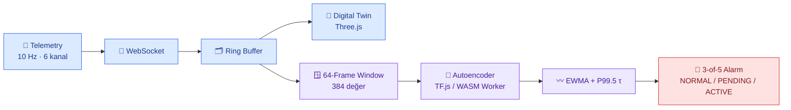

<!-- ─────────────  BAŞLIK  ───────────── -->

### Bilgisayar Mühendisliği Öğrencisi · Bursa Teknik Üniversitesi

**Endüstriyel AI · Real-Time Web Sistemleri · Backend & Altyapı**

 

---

## 👋 Hakkımda

Bursa Teknik Üniversitesi Bilgisayar Mühendisliği öğrencisiyim. İlgi alanım, **makine öğrenmesini
gerçek zamanlı sistemlerin içine yerleştirmek**: sensör verisini toplayan, görselleştiren ve
üzerinde anlamlı karar üreten uçtan uca uygulamalar geliştiriyorum.

Çalışma biçimimi üç ilke belirliyor:

- **Ölçülebilirlik** — Bir sistemin "çalıştığını" söylemek yetmez; precision, recall, latency ve
  bellek kullanımı ile ölçerim.
- **Şeffaflık** — Projelerimin sınırlamalarını sonuçlarıyla aynı yerde belgelerim.
- **Devredilebilirlik** — Projeyi devralan kişinin kurabileceği, çalıştırabileceği ve mimariyi
  anlayabileceği dokümantasyon yazarım.

> 🎯 Şu anda **endüstriyel yazılım, gömülü AI ve backend geliştirme** alanlarında staj ve
> proje iş birliklerine açığım.

---

## 🏭 Öne Çıkan Proje — SpikeEdge

### ⚡ Industrial Digital Twin & AI Anomaly Detection

**Endüstriyel telemetriyi gerçek zamanlı izleyen, Digital Twin üzerinde görselleştiren ve
anomaliyi tamamen tarayıcı içinde tespit eden uçtan uca prototip.**

### Teknik kararlar ve sonuçları

| Karar | Gerekçe | Ölçülen sonuç |
|---|---|---|
| Sabit eşik yerine **64 frame'lik davranışsal pencere** | Tek kanallı eşik, kanallar arası korelasyon bozulmasını göremiyor | Recall **%53.3 → %76.4** |
| **EWMA (α = 0.2) + 3-of-5 kalıcılık** politikası | Anlık gürültünün kalıcı alarma dönüşmesini engellemek | Precision **%100**, F1 **%86.6** |
| Inference'ın **Web Worker + WASM**'a taşınması | 3D render döngüsü ile GPU'da yarışmasın, UI thread bloklanmasın | Warm P50 **0.457 ms** |
| **Dondurulmuş μ / σ ve eşik** | Model çalışma anında kendi anomalisine adapte olmasın | Calibration FPR **≈ %0.543** |

| Model | Latent | Boyut | Throughput | Alarm F1 |
|:-:|:-:|:-:|:-:|:-:|
| Dense Autoencoder `384 → 64 → 16 → 64 → 384` | 16 (24:1 sıkıştırma) | ≈ 212 KB | ≈ 1686 inference/s | **%86.6** |

> **Şeffaflık notu:** Sistem simülasyon verisi kullanır; saha testi yapılmamıştır ve eşik
> kalibrasyonu bağımsız held-out sete dayanmaz. Bu sınırlamalar proje dokümantasyonunda
> sonuçlarla birlikte açıkça raporlanmıştır.

**→ [Projeyi ve tam teknik dokümantasyonu incele](https://github.com/mhmdrzanouriyani)**

---

## 🛠 Teknoloji Yığını

<table>
<tr><td valign="top" width="50%">

**Diller**

**Yapay Zekâ & Veri**

</td><td valign="top" width="50%">

**Frontend & 3D**

**Backend & Altyapı**

</td></tr>
</table>

---

## 📦 Diğer Çalışmalar

| Proje | Açıklama | Teknolojiler |
|---|---|---|
| **CloudDeploy** | Self-hosted VPS yönetim paneli — sunucu provizyonu, uzaktan komut yürütme, kimlik doğrulama | FastAPI · PostgreSQL · Redis · Celery · AsyncSSH · Docker · JWT + TOTP |
| **NetProbe++** | Python ile güvenilir UDP dosya transfer platformu — paket kaybı ve yeniden iletim yönetimi | Python · Socket · Bilgisayar Ağları |
| **MohixCode** | Farsça programlama ve yapay zekâ eğitim içerikleri — müfredat, ders materyalleri ve video üretimi | Next.js · İçerik üretimi · Teknik anlatım |
| **AI Agent çalışmaları** | ReAct tabanlı araştırma ajanı, Telegram otomasyon ajanı ve masaüstü otomasyon sistemi | FastAPI · SSE · LLM API'leri · Telethon |

---

## 🎓 Eğitim & Sertifikasyon

| Kurum / Alan | Ayrıntı |
|---|---|
| 🏛 **Bursa Teknik Üniversitesi** | Bilgisayar Mühendisliği — lisans |
| 🌐 **Cisco CCNA** | ITN (Introduction to Networks) — Modül 1–3 çalışması |
| ⚡ **Elektrik Devreleri** | Devre temelleri, mesh ve node analizi |
| 🗣 **Diller** | Farsça (ana dil) · Türkçe · İngilizce |

---

## 📊 GitHub İstatistikleri

  

---

## 📬 İletişim

Proje iş birliği, staj veya teknik bir soru için çekinmeden yazabilirsiniz.

 

💡 <i>"Bir sistemin değeri, çalışmasıyla değil; nasıl çalıştığının ölçülebilir ve
anlatılabilir olmasıyla belirlenir."</i>

